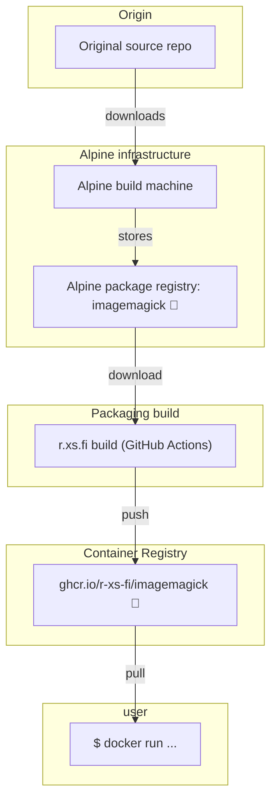

Container image for ImageMagick - free, open-source software suite, used for editing and manipulating digital images.

## Usage

### Rotate 90 degrees

```shell
docker run --rm -it -v $(pwd):/workspace ghcr.io/r-xs-fi/imagemagick input.png -rotate 90 output.png
```

## Supported platforms


| OS    | Architecture  | Supported | Example hardware |
|-------|---------------|-----------|-------------|
| Linux | amd64 | ✅       | Regular PCs (also known as x64-64) |
| Linux | arm64 | ✅       | Raspberry Pi with 64-bit OS, other single-board computers, Apple M1 etc. |
| Linux | arm/v7 | ✅       | Raspberry Pi with 32-bit OS, older phones |
| Linux | riscv64 | ✅       | More exotic hardware |

## How does this software get to me?


