Container image for ImageMagick - free, open-source software suite, used for editing and manipulating digital images.

## Usage

### Rotate 90 degrees

```shell
docker run --rm -it -v $(pwd):/workspace ghcr.io/r-xs-fi/imagemagick input.png -rotate 90 output.png
```

## Supported platforms


| OS    | Architecture  | Supported | Example hardware |
|-------|---------------|-----------|-------------|
| Linux | amd64 | ✅       | Regular PCs (also known as x64-64) |
| Linux | arm64 | ✅       | Raspberry Pi with 64-bit OS, other single-board computers, Apple M1 etc. |
| Linux | arm/v7 | ✅       | Raspberry Pi with 32-bit OS, older phones |
| Linux | riscv64 | ✅       | More exotic hardware |

## How does this software get to me?

```mermaid
flowchart TD
    subgraph "Origin"
        sourcerepo["Original source repo"]
    end
    subgraph "Alpine infrastructure"
        Alpine_build[Alpine build machine]
        Alpine_package[Alpine package registry: imagemagick 🔗]

        click Alpine_package "https://pkgs.alpinelinux.org/package/edge/community/x86/imagemagick"
    end
    subgraph "Packaging build"
        rxsfi_build["r.xs.fi build (GitHub Actions)"]
    end
    subgraph "Container Registry"
        r_xs_fi_package_registry[ghcr.io/r-xs-fi/imagemagick 🔗]

        click r_xs_fi_package_registry "https://ghcr.io/r-xs-fi/imagemagick"
    end
    subgraph "user"
        docker_run[$ docker run ...]
    end
    sourcerepo -- downloads --> Alpine_build -- stores --> Alpine_package
    Alpine_package -- download --> rxsfi_build
    rxsfi_build -- push --> r_xs_fi_package_registry
    r_xs_fi_package_registry -- pull --> docker_run[$ docker run ...]

```


